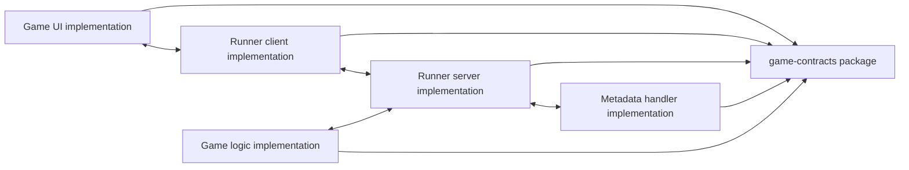

# Architecture

<!-- This diagram shows how the contract package is consumed by runner, UI, server, metadata, and game logic implementations. -->

## Overview

This repository is intentionally narrow. It defines the shared contracts that let the rest of the Game Framework ecosystem agree on message shapes, lifecycle responsibilities, and callable interfaces.

The package is split into two kinds of types:

- Message models in `message.py` for client/server payload exchange.
- Abstract base classes in the other modules for the runtime roles that must be implemented elsewhere.

## Major Components

### `message.py`

- `MessageSource` distinguishes `client` and `server` messages.
- `MessageEnvelope` carries `game_id`, `client_id`, `seq`, `signature`, and raw `payload` data.
- `ServerMessage` extends the envelope with a UTC timestamp and a computed `message_id` derived from the client ID, timestamp, and payload.

### `game_ui_abc.py`

- `GameUI` is the base class for UI implementations.
- It creates an asyncio queue for inbound server messages.
- It delegates server initialization, outbound actions, and polling to a runner client implementation.
- Subclasses must implement cleanup and message handling hooks.

### `logic_core_abc.py`

- `GameState` is the base model for state objects and requires `model_post_init`.
- `GameState.is_game_over` is a default placeholder that currently returns `False`.
- `CommandResult` models command execution outcomes and pending serialized commands.
- `Command` is the abstract action type executed against a `GameState`.

### `metadata_handler_abc.py`

- `GameMetadataHandlerABC` defines persistence and filtering operations for game metadata and player-specific views.

### `runner_client_abc.py`

- `RunnerClientABC` defines the client-side interface for polling, posting actions, and bootstrapping a game session.

### `runner_server_abc.py`

- `RunnerServerABC` defines the server-side interface for reading client messages, sending responses, and retrieving game state.

## Design Notes

- The package keeps implementation details out of the shared contract layer.
- Pydantic models provide schema validation and serialization behavior for message and state data.
- Abstract base classes are used instead of concrete adapters so the surrounding repositories can supply their own transport, storage, and UI implementations.
- `game-contracts` is distributed as a source package from `src/`.

## External Dependencies

- `pydantic>=2.11` for validation and serialization.
- Standard library modules for `abc`, `asyncio`, `datetime`, `enum`, `hashlib`, and `json`.