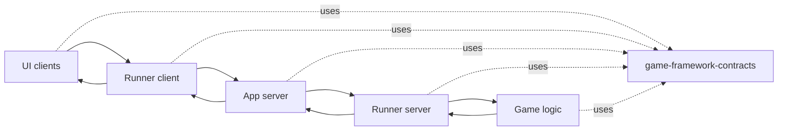

# Game Framework Ecosystem Overview

This repository is the shared contract layer for the Delirium / Game Framework workspace. It is the closest thing to a system-of-record because every runtime module depends on the message models and abstract interfaces defined here.

## System Map

<!-- This diagram shows the runtime loop and the shared contract dependency that all repos use. -->

## Role Of Each Repository

- `game-framework-contracts`: shared Python package for message envelopes, UI contracts, runner contracts, metadata contracts, and game-state / command abstractions.
- `game-framework-runners`: transport implementations that move messages between UIs, the app server, and metadata storage.
- `game-framework-app-server`: FastAPI broker that receives client messages, queues responses, and loads game logic dynamically.
- `delirium-logic-core`: concrete Delirium rules and command execution layer.
- `delirium-ui`: terminal UI that drives the Delirium client loop.
- `sample-game-ui`: reference UI implementation that demonstrates the framework pattern.
- `sample-logic-core`: reference logic implementation that demonstrates the framework pattern.
- `test-game-ui`: test-oriented UI harness used to exercise the client flow.

## What Lives In This Repo

### Message models

- `MessageSource` distinguishes client and server messages.
- `MessageEnvelope` carries `game_id`, `client_id`, `source`, `seq`, `signature`, and `payload`.
- `ServerMessage` adds a UTC timestamp and computes a deterministic `message_id` from the client ID, timestamp, and sorted payload JSON.

### UI contract

- `GameUI` owns the async queue used to receive server messages.
- `GameUI._initialize_server()` boots the server-side session through the runner client.
- `GameUI.start()` starts the background polling loop.
- Concrete UIs implement `_ui_game_cleanup()` and `handle_server_message()`.

### Logic contract

- `GameState` is the abstract Pydantic base for game state objects.
- `CommandResult` models success state, error text, and pending serialized commands.
- `Command` is the abstract action type and custom-serializes its `category` field.

### Runner contracts

- `RunnerClientABC` defines UI-side operations for polling, posting actions, listing games, creating games, and initializing the server.
- `RunnerServerABC` defines server-side operations for polling client messages, pushing responses, and reading game state.
- `GameMetadataHandlerABC` defines the metadata surface for game lists, new-game setup, state persistence, and player-specific filtering.

## Runtime Flow

1. A UI chooses a runner client and asks for a game ID or a new session.
2. The runner client initializes the app server and posts client actions.
3. The app server accepts messages, loads the registered game logic class, and drives the game loop.
4. The runner server verifies message ordering and signatures before handing messages to game logic.
5. Game logic updates state and returns a response or a new state payload.
6. The response is pushed back to the UI through the runner client polling loop.

## Design Decisions

- Shared data models use Pydantic so the same schema can validate, serialize, and round-trip across repos.
- Runtime roles are expressed as ABCs so each repo can provide its own transport, UI, metadata, or game-specific implementation.
- The contract layer stays implementation-light on purpose; application behavior belongs in the consuming repositories.
- The current message model keeps the envelope explicit so sequence handling, signatures, and client identity remain visible at the boundary.

## Important Boundaries

- `game-framework-contracts` is not a runnable app, server, or UI.
- `game-framework-runners` owns transport and retry behavior, not game rules.
- `game-framework-app-server` owns orchestration, not the core rules of any particular game.
- `delirium-logic-core` and `sample-logic-core` own game behavior, not transport.
- `delirium-ui`, `sample-game-ui`, and `test-game-ui` own client interaction, not game state.

## Practical Guidance

- When adding a new runtime component, implement the matching contract here first.
- When changing a message shape, update every consumer that serializes or verifies it.
- When adding a new game, register its logic class in the app server and keep the UI/game-name pairing consistent.
- When extending a runner, preserve message ordering and verification logic so the rest of the ecosystem continues to work.

## External Dependencies

- `pydantic>=2.11` provides validation, serialization, and computed fields.
- Standard library modules provide the enum, hashing, datetime, asyncio, abc, and JSON behavior used by the contract layer.
